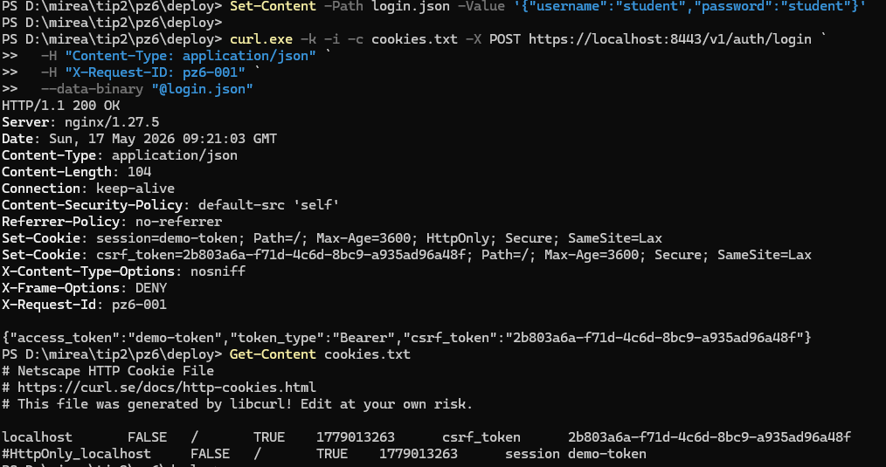
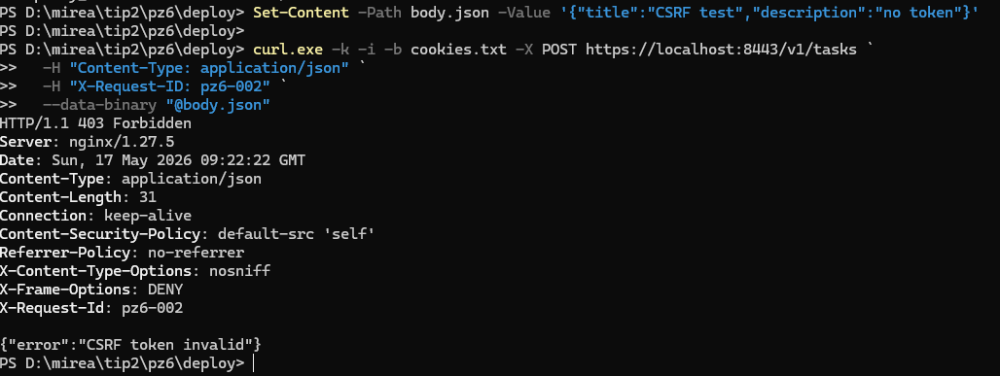
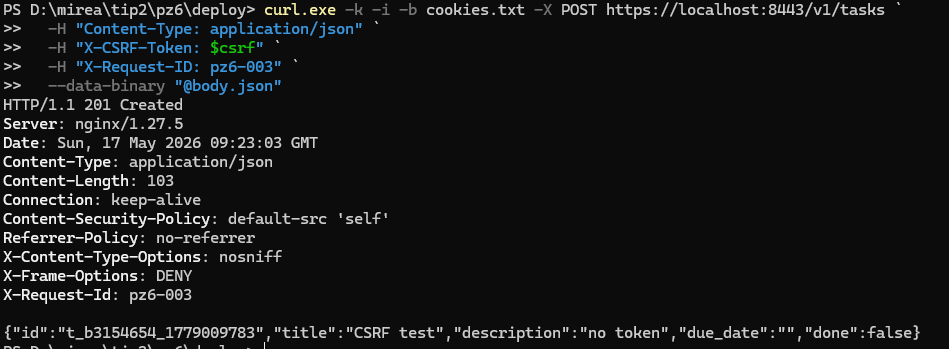
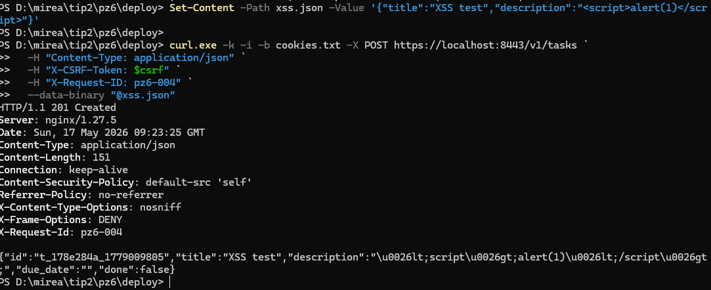
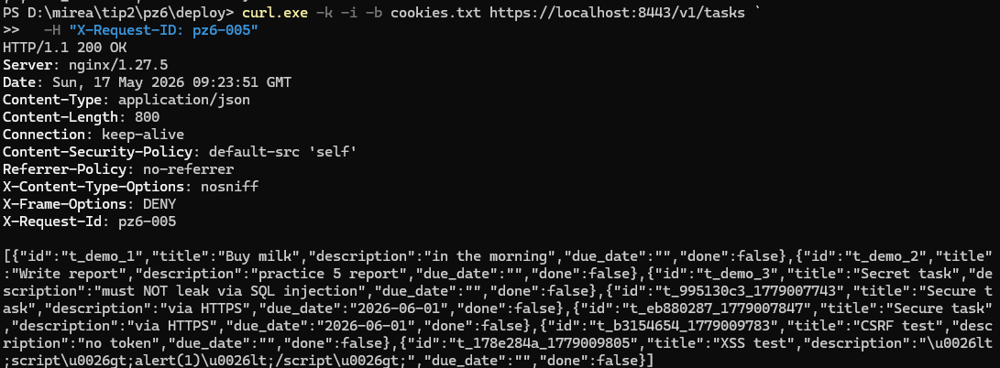
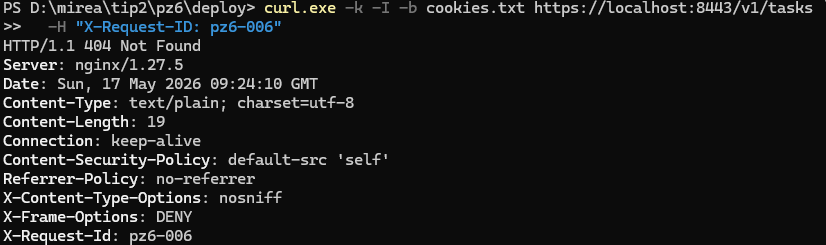

# Практическое занятие №6 — Защита от CSRF/XSS. Secure cookies

**Студент:** Выборнов Олег Андреевич
**Группа:** ЭФМО-02-25
**Дисциплина:** Технологии программирования

## Цель работы

Безопасно использовать cookies в серверном приложении и внедрить практические меры защиты от CSRF и XSS.

## Архитектура

```
                  HTTPS (8443)
   curl/браузер ─────────────► NGINX ──► auth   (8081)  cookies issue
                                    │
                                    └──► tasks  (8082)  CSRF/XSS protection
                                              │
                                              ▼
                                        PostgreSQL
```

Архитектура унаследована от ПЗ 5. В ПЗ 6 добавлены:
- эндпоинт `POST /v1/auth/login` в auth-сервисе, выдающий session+csrf cookies
- middleware `SecurityHeaders` (CSP, X-Frame-Options, X-Content-Type-Options, Referrer-Policy)
- middleware `CSRFProtection` (Double Submit Cookie)
- `html.EscapeString` для пользовательского ввода в поле `description`
- маршрут `/v1/auth/...` в nginx, проксирующий до auth-сервиса

## Используемые cookies и их флаги

| Cookie | Значение | HttpOnly | Secure | SameSite | Max-Age | Назначение |
|---|---|---|---|---|---|---|
| `session` | `demo-token` | да | да | Lax | 3600 | Идентификатор сессии |
| `csrf_token` | UUID | нет | да | Lax | 3600 | Токен для Double Submit Cookie |

**Почему такие флаги:**

- `HttpOnly` для session — JavaScript не может прочитать cookie, что защищает от кражи через XSS.
- `Secure` — cookie передаётся только по HTTPS.
- `SameSite=Lax` — предотвращает отправку cookies в кросс-сайтовых POST-запросах, но разрешает безопасные переходы по GET.
- `csrf_token` намеренно НЕ имеет `HttpOnly` — клиентский JS обязан её читать, чтобы выставить заголовок `X-CSRF-Token`.

## Выбранный подход к CSRF — Double Submit Cookie

1. Сервер генерирует случайный UUID и сохраняет его в cookie `csrf_token`.
2. Клиент (JS) читает значение cookie и добавляет его в заголовок `X-CSRF-Token` для всех запросов POST/PATCH/DELETE.
3. Middleware на сервере сравнивает cookie и заголовок. Если значения не совпадают или одно из них пустое — возвращает `403 Forbidden`.

**Почему это работает:** Same-Origin Policy браузера запрещает JavaScript с чужого домена читать наши cookies. Значит атакующий не может выставить правильный заголовок, даже если браузер автоматически приложит cookies к запросу-подделке.

GET, HEAD и OPTIONS проходят без проверки CSRF — они идемпотентны и не должны менять состояние.

## Защита от XSS

### Экранирование на сервере

Поле `description` проходит через `html.EscapeString` перед записью в БД:

```go
safeDescription := html.EscapeString(req.Description)
task, err := h.svc.Create(req.Title, safeDescription, req.DueDate)
```

Любые HTML-теги превращаются в безопасные сущности: `<script>` становится `&lt;script&gt;`.

**Замечание о подходе.** Архитектурно правильнее экранировать на ВЫВОДЕ (когда данные попадают в HTML-контекст), а не на ВХОДЕ — потому что в БД остаются «искажённые» данные, которые могут не подходить для не-HTML клиентов (мобильное приложение, экспорт в JSON). Но для учебной работы это компромиссное решение, обозначенное в коде комментарием.

### Заголовки безопасности

Middleware `SecurityHeaders` добавляет ко всем ответам:

| Заголовок | Значение | Назначение |
|---|---|---|
| `Content-Security-Policy` | `default-src 'self'` | Ресурсы только со своего домена — основная защита от XSS в браузере |
| `X-Content-Type-Options` | `nosniff` | Браузер не угадывает MIME-тип, предотвращает MIME confusion |
| `X-Frame-Options` | `DENY` | Защита от clickjacking — нельзя встроить в iframe |
| `Referrer-Policy` | `no-referrer` | URL не утекает в Referer при переходах |

`X-XSS-Protection` намеренно НЕ выставляется: заголовок устарел, удалён из Chrome, не поддерживается Firefox. Современная защита — CSP.

## Структура проекта

```
pz6/
├── deploy/
│   ├── Dockerfile.auth
│   ├── Dockerfile.tasks
│   ├── docker-compose.yml
│   ├── nginx.conf            # +location /v1/auth/ → auth:8081
│   └── tls/
├── migrations/
│   └── 01_create_tasks_table.sql
├── services/
│   ├── auth/
│   │   ├── cmd/auth/
│   │   └── internal/
│   │       ├── http/         # +POST /v1/auth/login с cookies
│   │       └── service/
│   └── tasks/
│       ├── cmd/tasks/        # подключение CSRF+SecurityHeaders middleware
│       └── internal/
│           ├── http/         # +session cookie auth, html.EscapeString
│           ├── service/
│           ├── repository/
│           └── client/
├── shared/
│   ├── middleware/
│   │   ├── requestid.go
│   │   ├── logging.go
│   │   ├── security.go       # НОВЫЙ: SecurityHeaders
│   │   └── csrf.go           # НОВЫЙ: CSRFProtection
│   └── httpx/
├── images/                   # скриншоты проверок
├── go.mod
└── README.md
```

## Запуск

```powershell
cd deploy
docker compose up -d --build
docker compose ps
```

Должно быть 4 контейнера: `pz6-postgres` (healthy), `pz6-auth`, `pz6-tasks`, `pz6-nginx`.

## Проверки

### 1. Логин и сохранение cookies

```powershell
Set-Content -Path login.json -Value '{"username":"student","password":"student"}'

curl.exe -k -i -c cookies.txt -X POST https://localhost:8443/v1/auth/login `
  -H "Content-Type: application/json" `
  --data-binary "@login.json"

Get-Content cookies.txt
```

В ответе видны два `Set-Cookie` (session с HttpOnly, csrf_token без HttpOnly) и тело с `access_token` и `csrf_token`. Файл `cookies.txt` содержит обе cookies.



### 2. POST без CSRF-токена → 403

```powershell
Set-Content -Path body.json -Value '{"title":"CSRF test","description":"no token"}'

curl.exe -k -i -b cookies.txt -X POST https://localhost:8443/v1/tasks `
  -H "Content-Type: application/json" `
  --data-binary "@body.json"
```

`session` cookie присутствует, авторизация бы прошла. Но заголовок `X-CSRF-Token` не передан — middleware блокирует запрос.

Ответ:

```
HTTP/1.1 403 Forbidden
{"error":"CSRF token invalid"}
```



### 3. POST с корректным CSRF-токеном → 201

```powershell
$csrf = (Get-Content cookies.txt | Select-String "csrf_token").ToString().Split("`t")[-1]

curl.exe -k -i -b cookies.txt -X POST https://localhost:8443/v1/tasks `
  -H "Content-Type: application/json" `
  -H "X-CSRF-Token: $csrf" `
  --data-binary "@body.json"
```

Значение cookie `csrf_token` и заголовка `X-CSRF-Token` совпали — middleware пропустил, задача создана.



### 4. XSS-payload → экранирование

```powershell
Set-Content -Path xss.json -Value '{"title":"XSS test","description":"<script>alert(1)</script>"}'

curl.exe -k -i -b cookies.txt -X POST https://localhost:8443/v1/tasks `
  -H "Content-Type: application/json" `
  -H "X-CSRF-Token: $csrf" `
  --data-binary "@xss.json"
```

В ответе `description` уже безопасный:

```
"description":"\u0026lt;script\u0026gt;alert(1)\u0026lt;/script\u0026gt;"
```

`\u0026` — это символ `&` в JSON-escape (стандартное поведение `encoding/json` для безопасности при встраивании JSON в HTML). После декодирования на клиенте — `&lt;script&gt;alert(1)&lt;/script&gt;`. Скрипт превращён в текст, браузер его не выполнит.



### 5. GET — XSS хранится экранированной

```powershell
curl.exe -k -i -b cookies.txt https://localhost:8443/v1/tasks
```

В массиве задач видна XSS-задача — `description` сохраняется в экранированном виде в БД.



### 6. Security headers

```powershell
curl.exe -k -I -b cookies.txt https://localhost:8443/v1/tasks
```

Заголовки безопасности применяются ко всем ответам — даже к 404 (HEAD-запрос не зарегистрирован в роутере, что нормально):

```
Content-Security-Policy: default-src 'self'
Referrer-Policy: no-referrer
X-Content-Type-Options: nosniff
X-Frame-Options: DENY
```

Middleware стоит ВНЕ маршрутизации, поэтому защита работает независимо от того, нашёлся хендлер или нет.



## Реализация — ключевые участки кода

### Auth: выдача cookies при логине

```go
http.SetCookie(w, &http.Cookie{
    Name:     "session",
    Value:    token,
    Path:     "/",
    HttpOnly: true,        // JS не прочитает — защита от XSS-кражи
    Secure:   true,        // только по HTTPS
    SameSite: http.SameSiteLaxMode,
    MaxAge:   3600,
})

http.SetCookie(w, &http.Cookie{
    Name:     "csrf_token",
    Value:    csrfToken,
    Path:     "/",
    HttpOnly: false,       // JS читает и шлёт в заголовке
    Secure:   true,
    SameSite: http.SameSiteLaxMode,
    MaxAge:   3600,
})
```

### Middleware: CSRF Protection

```go
func CSRFProtection(next http.Handler) http.Handler {
    return http.HandlerFunc(func(w http.ResponseWriter, r *http.Request) {
        switch r.Method {
        case http.MethodGet, http.MethodHead, http.MethodOptions:
            next.ServeHTTP(w, r)
            return
        }

        cookie, err := r.Cookie("csrf_token")
        header := r.Header.Get("X-CSRF-Token")

        if err != nil || cookie.Value == "" || header == "" || cookie.Value != header {
            // 403 + {"error":"CSRF token invalid"}
            return
        }

        next.ServeHTTP(w, r)
    })
}
```

### Middleware: Security Headers

```go
func SecurityHeaders(next http.Handler) http.Handler {
    return http.HandlerFunc(func(w http.ResponseWriter, r *http.Request) {
        h := w.Header()
        h.Set("Content-Security-Policy", "default-src 'self'")
        h.Set("X-Content-Type-Options", "nosniff")
        h.Set("X-Frame-Options", "DENY")
        h.Set("Referrer-Policy", "no-referrer")
        next.ServeHTTP(w, r)
    })
}
```

### Порядок применения middleware (tasks/cmd/tasks/main.go)

```go
var mux http.Handler = handler.Routes()
mux = middleware.CSRFProtection(mux)   // 4-й слой - проверка CSRF
mux = middleware.SecurityHeaders(mux)  // 3-й слой - security headers
mux = middleware.Logging(mux)          // 2-й слой - access log
mux = middleware.RequestID(mux)        // 1-й внешний слой - X-Request-ID
```

Читается снизу вверх: запрос проходит сначала через RequestID, потом Logging, потом SecurityHeaders, потом CSRFProtection, и только потом попадает в роутер.

## Контрольные вопросы

**1. Что такое CSRF и почему атака возможна?**

Cross-Site Request Forgery — атака, в которой жертва, авторизованная на сайте A, переходит на вредоносный сайт B, который отправляет запрос на сайт A. Браузер автоматически прикладывает к запросу cookies жертвы, и сайт A считает запрос легитимным. Возможна, потому что HTTP-cookies отправляются браузером ко всем запросам на их домен без учёта того, откуда запрос инициирован.

**2. Чем Double Submit Cookie защищает от CSRF?**

Сервер выдаёт CSRF-токен в cookie и требует, чтобы тот же токен был передан в HTTP-заголовке. Same-Origin Policy запрещает JavaScript с чужого домена читать cookies нашего домена — значит атакующий не сможет узнать токен и подставить его в заголовок. Браузер по-прежнему пришлёт cookies автоматически, но без правильного заголовка запрос будет отклонён.

**3. Зачем флаг HttpOnly на session cookie?**

`HttpOnly` запрещает JavaScript читать значение cookie через `document.cookie`. Если на сайт удастся внедрить XSS-скрипт, он не сможет украсть session-токен и отправить его на сервер атакующего. Это основная защита от кражи сессии при XSS.

**4. Почему csrf_token не имеет HttpOnly, а session имеет?**

CSRF-токен по архитектуре Double Submit Cookie должен быть доступен клиентскому JavaScript — он его читает и кладёт в заголовок `X-CSRF-Token`. Поэтому `HttpOnly` для него не подходит. Но это не уязвимость: даже если CSRF-токен украдут через XSS, атакующему всё равно нужен ещё и session-токен, который защищён `HttpOnly`.

**5. Что делает Content-Security-Policy: default-src 'self'?**

Запрещает браузеру загружать ресурсы (скрипты, стили, шрифты, изображения, фреймы) с других доменов. Если злоумышленник внедрит на страницу `<script src="https://evil.com/x.js">`, браузер откажется его выполнить. CSP — современная и наиболее эффективная защита от XSS в браузере.

**6. Почему экранирование `description` через html.EscapeString — компромисс, а не идеал?**

Архитектурно правильнее экранировать данные ПРИ ВЫВОДЕ в конкретный контекст (HTML, JSON, JavaScript-литерал — у каждого свои правила), а не при записи. В нашей схеме `description` хранится в БД уже искажённым: если потом понадобится отдать его не в HTML (мобильному клиенту, в CSV-экспорт, в PDF) — текст придётся «расэкранировать». Правильно — хранить чистые данные и экранировать в момент рендеринга по правилам целевого контекста.
